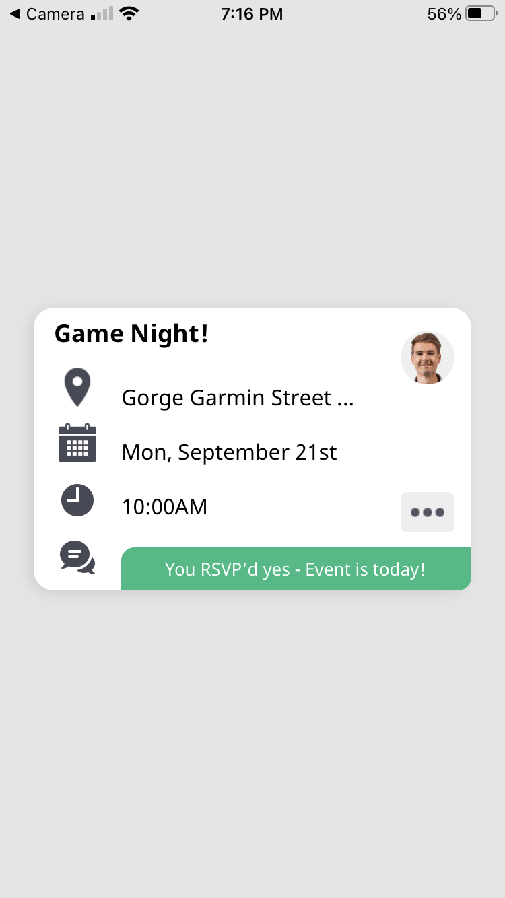
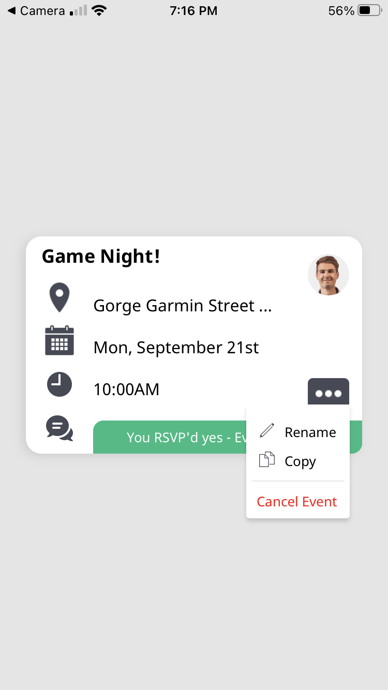

# Screening Project for FE Position at Likemindedly

This mini React Native app displays an example event card with the event's title and details. Users can click on the ellipsis button in the bottom right of the card to reveal a dropdown menu of options for editing the event.

### Screenshots

### How to run the app
- clone down this repository
- run `npm install -g expo-cli`
- `cd` into the project directory
- run `npm install`
- run `npm start` or `expo start`
- At this point, an expo window will open on your local server. From there, you can scan the QR code to open the app on your phone using the Expo mobile app, or run the app in a simulator (via Xcode).

### How to test the app
Given the apps very limited functionality, minimal snapshot tests are written in Jest to ensure consistency in the UI.
- after running `npm install`, run `npm test`
